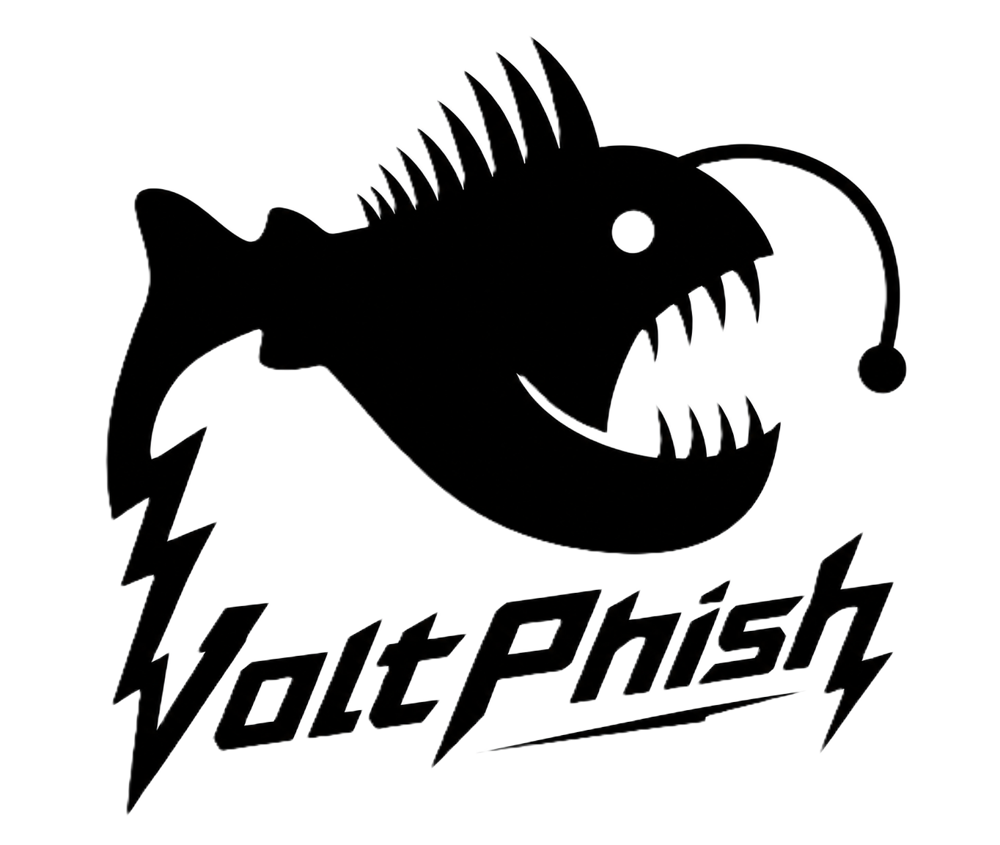

<div align="center">
  <picture>
    <source media="(prefers-color-scheme: dark)" srcset="docs/logo-light.png" />
    
  </picture>

  <h1>VoltPhish</h1>
  <p><strong>The modern, open-source phishing-simulation & human-risk platform.</strong><br/>
  Run realistic email & QR attack simulations — turn every fail into a lesson, catch every report, and measure your people's risk. All from one Docker container.</p>

  <p>
    
    
    
    
    
  </p>
</div>

> ⚠️ **Authorized use only.** VoltPhish is for testing organizations and people who have **consented** to being tested — your own company, a client engagement with signed scope, or a lab. Using it against anyone else is likely illegal. See [Responsible use](#-responsible-use).

---

## Why VoltPhish

Most open-source phishing tools stop at **"who clicked."** VoltPhish runs the whole program a real awareness team needs — **attack → report → teach → measure** — as a full-stack app (React admin + FastAPI backend + tracking server) in **one process, one container**, secure-by-default.

It's built for the people who *run* awareness programs, not just red teams: multi-vector lures, a one-click Report-Phish button for employees, a built-in training LMS that auto-enrolls anyone who fails, human-risk analytics, SSO, and 2FA — the things that usually mean paying for KnowBe4 or Proofpoint.

## 🚀 Quickstart — one command

```bash
docker compose up --build
```

1. Open **http://localhost:8080**
2. Grab the first-run admin password from the logs:
   ```bash
   docker compose logs phishsim | grep -A3 "first-run"
   ```
   (or set `PHISHSIM_BOOTSTRAP_ADMIN_PASSWORD` in `docker-compose.yml` to choose your own.)
3. Sign in, set a new password, and go. With the default **console** mail backend, launching a campaign writes each email as a `.eml` file to the data volume instead of sending — so you can walk the whole open → click → submit → teach flow with **zero real email**. Switch `PHISHSIM_MAIL_BACKEND=smtp` and add a Sending Profile to deliver for real (against hosts you're authorized to test).

Data (SQLite + outbox) persists in the `phishsim-data` volume. Use `docker compose up -d` to keep it — **not** `down -v`, which wipes the volume.

## ✨ Features

### 🎣 Attack simulations — multi-vector
- **📧 Email phishing** — WYSIWYG templates with `{{.FirstName}}` / `{{.URL}}` personalization, a ready-made **gallery** (IT, Microsoft 365, Google, HR, courier, MFA…), `.eml` import, and attachments with **open-tracking**.
- **🔲 QR / quishing** — per-recipient QR codes that open the tracking link; rendered server-side so they survive Outlook/Gmail.
- **📅 Calendar (.ics) lures** — meeting-invite attachments with a tracked "join" link — a vector most tools ignore.
- **🖱️ ClickFix "verify you're human"** & **🪟 Browser-in-the-Browser** — modern 2025-era landing pages (fake CAPTCHA, spoofed SSO popup).
- **🤖 AI generation** — describe a scenario and draft a full **email or landing page** with Claude, GPT, or Gemini (bring your own key; provider configurable in Settings).
- **🖥️ Landing pages** — login-clone gallery + form capture. Any `<form>` is auto-captured — **passwords are never stored.**

### 📨 Catch the reports — the human firewall
- **🔘 Report-Phish button** — a **native Outlook add-in** and **Gmail Apps Script** give employees one-click reporting. Reporting a simulation credits them as a Champion; reporting a *real* suspicious email routes it to an admin **triage queue**.
- **📥 IMAP reported-phish monitoring** — or point VoltPhish at a shared mailbox; it polls, matches forwarded reports to the recipient, and credits them automatically.

### 🎓 Close the loop — teach & train
- **⚡ Just-in-time training** — anyone who clicks/submits lands on a teaching page with the red flags and a tracked "I understand."
- **📚 Training LMS + content library** — build modules (HTML + video + quizzes), assign to groups, and deliver via unique per-trainee links. Ships with **4 starter modules** (Spot the Phish, Password Hygiene & MFA, BEC, Reporting). Completion tracking, pass scores, **points & a leaderboard**.
- **🧠 Adaptive auto-enrollment** — fail a simulation and get **auto-enrolled** in training at a difficulty matched to your behaviour — the "teachable moment," automated.

### 📊 Measure risk
- **🧠 Human Risk Score** — a behaviour-based risk index per user and per department.
- **🎯 Attack surface & VIPs** — flag execs/finance as **VIP** and track who's most-targeted (VAP-style).
- **🌍 Geo-IP map** — where clicks and submits came from.
- **📈 Industry benchmark** — compare your click & report rates against a baseline you set from public data (DBIR, vendor reports) — honest, no fabricated peer numbers.
- **🏆 Security Champions**, **at-risk users**, engagement funnel, timeline chart, and a one-click **board-level PDF report**.

### 🔐 Enterprise-grade access
- **🪪 Single Sign-On (OIDC)** — Okta, Microsoft Entra ID, Google, Auth0, Keycloak — with PKCE and full ID-token validation.
- **🔑 Admin 2FA (TOTP)** — Google Authenticator / Authy / 1Password, with QR enrollment.
- **👥 Granular RBAC** — delegate specific admin areas (users, settings, webhooks, training, reports) to an operator without handing over full admin.

### 🚚 Ops & delivery
- **🔔 Real-time Slack / Microsoft Teams alerts** the moment someone clicks or submits.
- **📬 Deliverability toolkit** — SPF/DKIM/DMARC **pre-flight check**, plus an **allowlist generator** that emits the exact, scoped entries for Microsoft 365 Advanced Delivery, Google Workspace, and generic SEGs.
- **🔗 Signed webhooks** (HMAC-SHA256, SSRF-guarded) & **REST API keys** (`Bearer`).
- **⏱️ Scheduling & drip throttle**, a **durable retrying job queue**, and **bulk actions** across every list.
- **⚙️ One-command Docker** with auto-bootstrapped admin and Alembic migrations applied on startup.

## 🆚 How it compares

VoltPhish's only actively-maintained open-source peer is **Gophish** (no release since 2022). Here's the honest picture against it and the commercial platforms (KnowBe4 / Proofpoint / Cofense):

| Capability | **VoltPhish** | Gophish | Commercial SAT |
|---|:---:|:---:|:---:|
| Email simulation + tracking | ✅ | ✅ | ✅ |
| QR / quishing | ✅ | ❌ | ✅ |
| Calendar (.ics) lures | ✅ | ❌ | ~ |
| AI content generation | ✅ | ❌ | ~ (mostly curation) |
| Report-Phish button (Outlook/Gmail) | ✅ | ❌ | ✅ |
| IMAP reported-phish → Champions | ✅ | ✅ | ✅ |
| Training LMS + quizzes + gamification | ✅ | ❌ | ✅ |
| Just-in-time adaptive auto-enroll | ✅ | ❌ | ✅ |
| Human risk score / VAP view | ✅ | ❌ | ✅ |
| Geo-IP results map | ✅ | ❌ | ✅ |
| Industry benchmark | ✅ (self-set) | ❌ | ✅ (peer data) |
| SSO (OIDC) | ✅ | ❌ | ✅ |
| Admin 2FA | ✅ | ❌ | ✅ |
| Granular RBAC / delegated admin | ✅ | ❌ | ✅ |
| Deliverability check + allowlist gen | ✅ | ❌ | ✅ |
| Self-hosted & free | ✅ | ✅ | ❌ |
| Actively maintained | ✅ | ❌ (2022) | ✅ |

## 🧩 Tech stack

| Layer | Stack |
|---|---|
| Backend | FastAPI, SQLAlchemy 2.0, Pydantic v2, Alembic, aiosmtplib, httpx, authlib, pyotp, segno |
| Frontend | React 18 + TypeScript, Vite, hand-rolled SVG charts, CKEditor 5 |
| Security | argon2id hashing, AES-256-GCM column encryption, TOTP 2FA, OIDC SSO, CSRF, SSRF guard, rate-limit + lockout, CSP/HSTS headers |
| Deploy | Multi-stage Docker (node build → python runtime), SQLite volume |

## 🛠️ Local dev (without Docker)

```bash
# Backend (auto-creates an admin, prints the password)
cd backend
python -m venv .venv && .venv/Scripts/python -m pip install -r requirements.txt
.venv/Scripts/python -m uvicorn app.main:app --port 8080 --reload

# Frontend (hot reload, proxies /api → :8080)
cd frontend && npm install && npm run dev
```

Interactive API docs (dev only): `http://localhost:8080/api/docs`

## 🔐 Responsible use

VoltPhish is a *simulation* tool, deliberately built so it can't quietly become a credential-harvesting kit:

- **Submitted passwords are never persisted.** The landing endpoint reads the form and discards the password; by default no submitted field values are stored at all — only that a submission occurred, for your metrics.
- Secrets (SMTP, API keys, IMAP, SSO client secret, TOTP) are **encrypted at rest** (AES-256-GCM) and never returned by the API.
- Every campaign action is recorded in an **append-only audit log**.
- Tracking links use unguessable per-recipient tokens; invalid tokens return a benign response and record nothing.
- The tool is scoped for defensive, authorized training — it deliberately omits offensive capabilities like live MFA-bypass session-proxying.

Only run campaigns against recipients within your authorized scope, and keep a record of that authorization. See [SECURITY.md](SECURITY.md) for the threat model and control mapping.

## 📄 License

[MIT](LICENSE) — do good with it.
