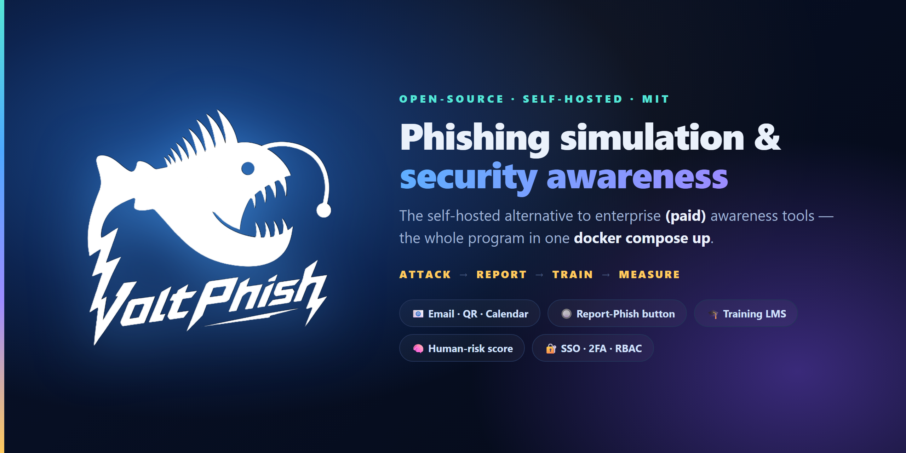
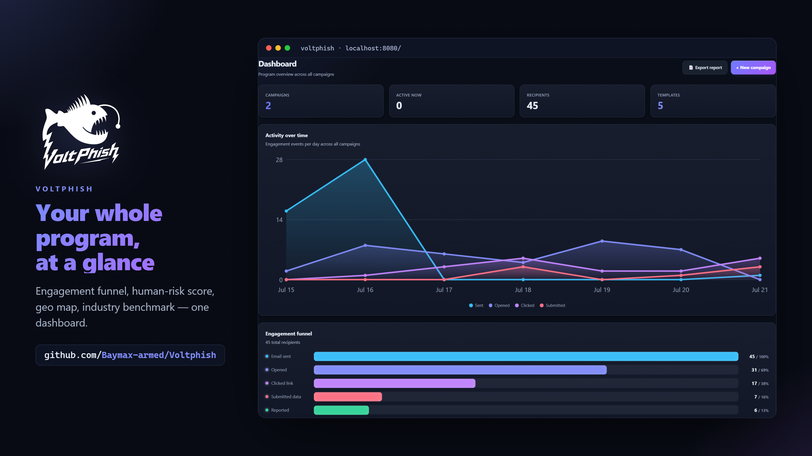
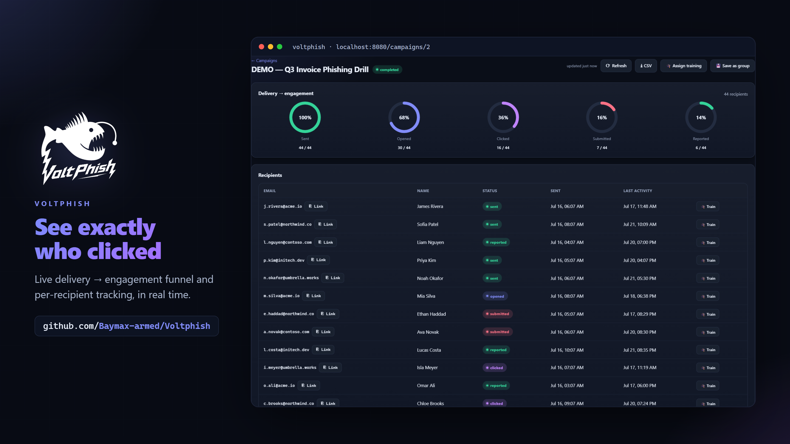
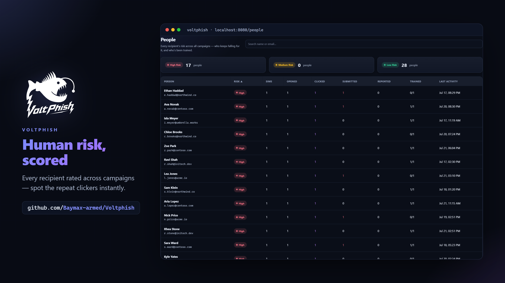
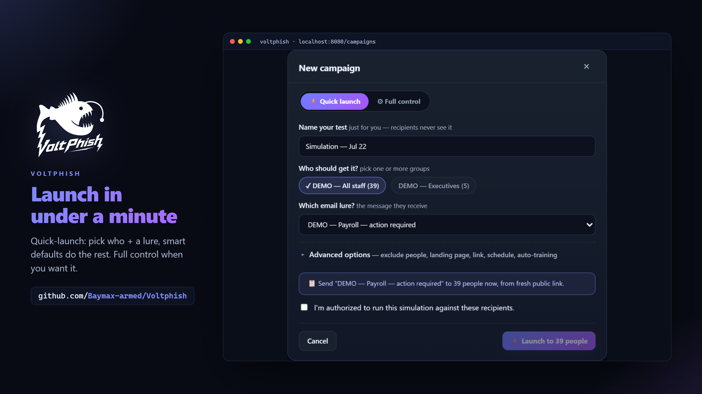
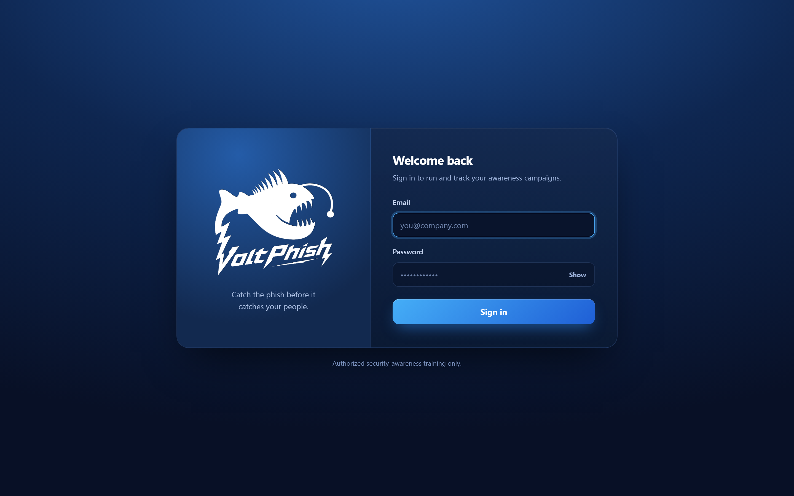

<div align="center">
  

  <h1>⚡ VoltPhish</h1>
  <p><strong>Run your whole phishing-awareness program from one Docker container.</strong><br/>
  Send a realistic email or QR lure, see exactly who clicked, teach them the moment they slip, catch the ones who report it, and watch your team's risk drop over time.</p>

  <p><em>Most free tools stop at "who clicked" — and a lot of them haven't been touched in years. VoltPhish runs the full loop: <strong>attack → report → train → measure</strong>. Self-hosted, secure by default, and actually maintained.</em></p>

  <p>
    
    
    
    
    
  </p>

  <sub>⭐ If VoltPhish saves you time, <a href="https://github.com/Baymax-armed/Voltphish">a star</a> genuinely helps other people find it.</sub>
</div>

<br/>

> ⚠️ **Authorized use only.** VoltPhish is for testing people who've **agreed** to be tested — your own company, a client engagement with signed scope, or a lab you own. Point it at anyone else and you're very likely breaking the law. More in [Responsible use](#-responsible-use).

---

## 👋 What is this?

If you've ever wanted to run a phishing simulation for your team but didn't want to pay for an enterprise seat or wrestle with an abandoned open-source project, VoltPhish is for you.

It's a single app — a clean React admin, a FastAPI backend, and the tracking server — that does everything a real awareness program needs:

- **Send** a believable lure (email, QR code, calendar invite, or attachment).
- **Track** every open, click, and form submission per person, in real time.
- **Teach** anyone who falls for it, right at the teachable moment.
- **Catch** the employees who spot it and report it — and give them credit.
- **Measure** who's actually at risk, department by department, over time.

Spin it up with one command, and with the default settings it writes each "sent" email to a file instead of mailing it — so you can walk the entire open → click → submit → train flow with **zero real email** before you ever touch a live inbox.

## 📸 A look inside

<table>
  <tr>
    <td width="50%"><br/><sub><b>Dashboard</b> — your whole program at a glance: engagement funnel, human-risk score, geo map, industry benchmark.</sub></td>
    <td width="50%"><br/><sub><b>Campaign results</b> — live delivery → engagement, and exactly who clicked, per recipient.</sub></td>
  </tr>
  <tr>
    <td width="50%"><br/><sub><b>People</b> — every recipient scored across every campaign, so repeat clickers jump out instantly.</sub></td>
    <td width="50%"><br/><sub><b>Builder</b> — quick-launch a test in under a minute; smart defaults do the rest, full control when you want it.</sub></td>
  </tr>
</table>

<div align="center">
  
</div>

## 💡 Why VoltPhish

Here's the honest gap it fills. Most free phishing tools can tell you **"someone clicked"** and not much more. The paid platforms do everything, but they're built for big budgets and locked behind a sales call.

VoltPhish is for the people who actually *run* awareness programs, not just red teams. That means the stuff that usually forces you onto an enterprise plan is right here, in the open:

- Multi-vector lures (not just email).
- A one-click **Report-Phish button** so employees can flag real threats.
- A built-in **training LMS** that auto-enrolls anyone who fails.
- Human-risk analytics, SSO, and 2FA.

All of it in one process, one container, secure by default.

## 📦 Installation

VoltPhish runs on **port 8010**. Port 8080 is left free on purpose — that's usually where your pentest tooling (Burp and friends) wants to live.

### Option A — Docker (recommended)

```bash
docker compose up --build
```

1. Open **http://localhost:8010**
2. Grab the first-run admin password from the logs:
   ```bash
   docker compose logs voltphish | grep -A3 "first-run"
   ```
   (Prefer to pick your own? Set `VOLTPHISH_BOOTSTRAP_ADMIN_PASSWORD` in `docker-compose.yml`.)
3. Sign in, choose a new password, and you're in. With the default **console** mail backend, launching a campaign writes each email as a `.eml` file to the data volume instead of sending it — so you get the full open → click → submit → teach flow with **no real email at all**. When you're ready to send for real (against hosts you're authorized to test), set `VOLTPHISH_MAIL_BACKEND=smtp` and add a Sending Profile.

Your data (SQLite + outbox) lives in the `voltphish-data` volume. Use `docker compose up -d` to keep it running — just avoid `down -v`, which wipes the volume.

### Option B — Run from source (no Docker)

```bash
# Backend (auto-creates an admin and prints the password) — served on :8010
cd backend
python -m venv .venv && .venv/Scripts/python -m pip install -r requirements.txt
.venv/Scripts/python -m uvicorn app.main:app --port 8010 --reload

# Frontend (hot reload, proxies /api → :8010)
cd frontend && npm install && npm run dev
```

Then open the Vite dev server it prints (usually **http://localhost:5173**). Interactive API docs (dev only) live at `http://localhost:8010/api/docs`.

## ✨ Everything it does

Nothing hidden here — this is the full feature set.

### 🎣 Attack simulations — multi-vector
- **📧 Email phishing** — WYSIWYG templates with `{{.FirstName}}` / `{{.URL}}` personalization, a ready-made **gallery** (IT, Microsoft 365, Google, HR, courier, MFA…), `.eml` import, and attachments with **open-tracking**.
- **🔲 QR / quishing** — per-recipient QR codes that open the tracking link, rendered server-side so they survive Outlook and Gmail.
- **📅 Calendar (.ics) lures** — meeting-invite attachments with a tracked "join" link, a vector most tools ignore.
- **🖱️ ClickFix "verify you're human"** & **🪟 Browser-in-the-Browser** — modern 2025-era landing pages (fake CAPTCHA, spoofed SSO popup).
- **🤖 AI generation** — describe a scenario and draft a full **email or landing page** with Claude, GPT, or Gemini (bring your own key; provider is configurable in Settings).
- **🖥️ Landing pages** — a login-clone gallery plus form capture. Any `<form>` is auto-captured — and **passwords are never stored.**

### 📨 Catch the reports — the human firewall
- **🔘 Report-Phish button** — a native **Outlook add-in** and a **Gmail Apps Script** give employees one-click reporting. Report a simulation and you're credited as a Champion; report a *real* suspicious email and it lands in an admin **triage queue**.
- **📥 IMAP reported-phish monitoring** — point VoltPhish at a shared mailbox and it polls, matches forwarded reports back to the recipient, and credits them automatically.

### 🎓 Close the loop — teach & train
- **⚡ Just-in-time training** — anyone who clicks or submits lands on a teaching page with the red flags they missed and a tracked "I understand."
- **📚 Training LMS + content library** — build modules (HTML + video + quizzes), assign them to groups, and deliver via unique per-trainee links. Ships with **4 starter modules** (Spot the Phish, Password Hygiene & MFA, BEC, Reporting). Completion tracking, pass scores, **points, and a leaderboard**.
- **🧠 Adaptive auto-enrollment** — fail a simulation and get **auto-enrolled** in training at a difficulty matched to your behaviour. The teachable moment, automated.

### 📊 Measure risk
- **🧠 Human Risk Score** — a behaviour-based risk index per user and per department.
- **🎯 Attack surface & VIPs** — flag execs and finance as **VIP** and track who's most-targeted (VAP-style).
- **🌍 Geo-IP map** — where clicks and submits actually came from.
- **📈 Industry benchmark** — compare your click and report rates against a baseline you set from public data (DBIR, vendor reports). Honest, with no made-up peer numbers.
- **🏆 Security Champions**, **at-risk users**, engagement funnel, timeline chart, and a one-click **board-level PDF report**.

### 🔐 Enterprise-grade access
- **🪪 Single Sign-On (OIDC)** — Okta, Microsoft Entra ID, Google, Auth0, Keycloak — with PKCE and full ID-token validation.
- **🔑 Admin 2FA (TOTP)** — Google Authenticator, Authy, 1Password, with QR enrollment.
- **👥 Granular RBAC** — hand a specific admin area (users, settings, webhooks, training, reports) to an operator without giving away the keys to everything.

### 🚚 Ops & delivery
- **🔔 Real-time Slack / Microsoft Teams alerts** the moment someone clicks or submits.
- **📬 Deliverability toolkit** — an SPF/DKIM/DMARC **pre-flight check**, plus an **allowlist generator** that spits out the exact, scoped entries for Microsoft 365 Advanced Delivery, Google Workspace, and generic secure email gateways.
- **🔗 Signed webhooks** (HMAC-SHA256, SSRF-guarded) & **REST API keys** (`Bearer`).
- **⏱️ Scheduling & drip throttle**, a **durable retrying job queue**, and **bulk actions** across every list.
- **🌐 Per-campaign public links** — an optional bundled Cloudflare Tunnel gives each campaign its own fresh public URL (with a time limit you set), so landing pages open on the internet without a custom domain.
- **🌗 Dark & light themes**, and **one-command Docker** with an auto-bootstrapped admin and Alembic migrations applied on startup.

## 🆚 How it compares

An honest picture against typical open-source tools (most unmaintained) and paid enterprise platforms:

| Capability | **VoltPhish** | Typical OSS tool | Enterprise (paid) |
|---|:---:|:---:|:---:|
| Email simulation + tracking | ✅ | ✅ | ✅ |
| QR / quishing | ✅ | ❌ | ✅ |
| Calendar (.ics) lures | ✅ | ❌ | ~ |
| AI content generation | ✅ | ❌ | ~ (mostly curation) |
| Report-Phish button (Outlook/Gmail) | ✅ | ❌ | ✅ |
| IMAP reported-phish → Champions | ✅ | ✅ | ✅ |
| Training LMS + quizzes + gamification | ✅ | ❌ | ✅ |
| Just-in-time adaptive auto-enroll | ✅ | ❌ | ✅ |
| Human risk score / VAP view | ✅ | ❌ | ✅ |
| Geo-IP results map | ✅ | ❌ | ✅ |
| Industry benchmark | ✅ (self-set) | ❌ | ✅ (peer data) |
| SSO (OIDC) | ✅ | ❌ | ✅ |
| Admin 2FA | ✅ | ❌ | ✅ |
| Granular RBAC / delegated admin | ✅ | ❌ | ✅ |
| Deliverability check + allowlist gen | ✅ | ❌ | ✅ |
| Self-hosted & free | ✅ | ✅ | ❌ |
| Actively maintained | ✅ | ⚠️ often stale | ✅ |

## 🧩 Under the hood

| Layer | Stack |
|---|---|
| Backend | FastAPI, SQLAlchemy 2.0, Pydantic v2, Alembic, aiosmtplib, httpx, authlib, pyotp, segno |
| Frontend | React 18 + TypeScript, Vite, hand-rolled SVG charts, CKEditor 5 |
| Security | argon2id hashing, AES-256-GCM column encryption, TOTP 2FA, OIDC SSO, CSRF, SSRF guard, rate-limit + lockout, CSP/HSTS headers |
| Deploy | Multi-stage Docker (node build → python runtime), SQLite volume |

## 🔐 Responsible use

VoltPhish is a *simulation* tool, and it's built on purpose so it can't quietly turn into a credential-harvesting kit:

- **Submitted passwords are never persisted.** The landing endpoint reads the form and throws the password away. By default no submitted field values are stored at all — only *that* a submission happened, for your metrics.
- Secrets (SMTP, API keys, IMAP, SSO client secret, TOTP) are **encrypted at rest** (AES-256-GCM) and never returned by the API.
- Every campaign action is written to an **append-only audit log**.
- Tracking links use unguessable per-recipient tokens; an invalid token returns a harmless response and records nothing.
- It's scoped for defensive, authorized training, and deliberately leaves out offensive capabilities like live MFA-bypass session-proxying.

Only run campaigns against people inside your authorized scope, and keep a record of that authorization. The full threat model and control mapping is in [SECURITY.md](SECURITY.md).

## 🤝 Contributing & thanks

Issues, ideas, and PRs are all welcome — start with [CONTRIBUTING.md](CONTRIBUTING.md), and see the people who've helped in [CONTRIBUTORS.md](CONTRIBUTORS.md). Be kind; we follow a simple [Code of Conduct](CODE_OF_CONDUCT.md).

## 📄 License

[MIT](LICENSE) — go do good with it.
